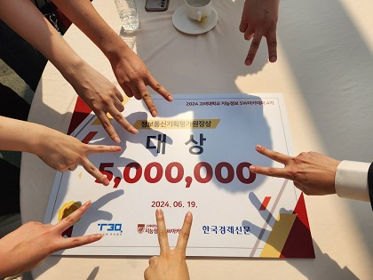

## 🛠️ ALF: Automated Lost & Find

### 📹 실시간 CCTV 데이터를 활용하여 즉각적인 알림을 통해
### 🚨 효율적으로 유실물을 방지하는 솔루션

> ALF를 이용해서 유실물을 미연에 방지하세요!
> 중요한 물건을 잃어버린 적이 있나요? 🤔
> 더는 잃어버린 물건을 찾느라 헤매지 마세요.

# 🛠️ 기술 스택
**프로젝트에 사용된 주요 기술들** 💻

<p align="center">


</p>

<p align="center">


</p>

# 🚧 파이프라인
**효율적인 인공지능 모델 흐름 구축** 🔄


# 📊 데이터셋
**데이터셋은 모델 구동의 생명** 💡

- [📊 COCO Dataset에 대한 고찰](https://velog.io/@tasker_dev/COCO-Dataset%EC%97%90-%EB%8C%80%ED%95%9C-%EA%B3%A0%EC%B0%B0)

# 🖥 인공 지능 기초 스터디
**기초부터 차근 차근** 📚

- [📘 컴퓨터 비전과 딥러닝 스터디 : Chapter 09 인식](https://velog.io/@tasker_dev/%EC%BB%B4%ED%93%A8%ED%84%B0-%EB%B9%84%EC%A0%84%EA%B3%BC-%EB%94%A5%EB%9F%AC%EB%8B%9D-%EC%8A%A4%ED%84%B0%EB%94%94-1)  
  <br>
- [📙 컴퓨터 비전과 딥러닝 스터디 : Chapter 10 동적 비전](https://velog.io/@tasker_dev/%EC%BB%B4%ED%93%A8%ED%84%B0-%EB%B9%84%EC%A0%84%EA%B3%BC-%EB%94%A5%EB%9F%AC%EB%8B%9D-%EC%8A%A4%ED%84%B0%EB%94%94-2)  
  <br>
- [📗 컴퓨터 비전과 딥러닝 스터디 : Chapter 11 비전 트랜스포머](https://velog.io/@tasker_dev/%EC%BB%B4%ED%93%A8%ED%84%B0-%EB%B9%84%EC%A0%84%EA%B3%BC-%EB%94%A5%EB%9F%AC%EB%8B%9D-%EC%8A%A4%ED%84%B0%EB%94%94-3)  
  <br>
- [📕 컴퓨터 비전과 딥러닝 스터디 : Chapter 12 3차원 비전](https://velog.io/@tasker_dev/%EC%BB%B4%ED%93%A8%ED%84%B0-%EB%B9%84%EC%A0%84%EA%B3%BC-%EB%94%A5%EB%9F%AC%EB%8B%9D-%EC%8A%A4%ED%84%B0%EB%94%94-4)

# 🔍 논문 스터디
**좀 더 깊게 파고들기** 📑

- [📷 R-CNN - 지역 제안과 CNN을 결합한 객체 탐지 모델로, 이미지 내에서 객체를 식별.](https://velog.io/@tasker_dev/R-CNN)  
  <br>
- [🚀 Fast R-CNN - 객체 탐지 속도와 정확도를 높인 Region-based Convolutional Network 모델.](https://velog.io/@tasker_dev/Fast-R-CNN)  
  <br>
- [🔍 Yolo-v1 - 실시간 객체 탐지를 위한 최초의 YOLO(You Only Look Once) 모델.](https://velog.io/@tasker_dev/Yolo-v1)  
  <br>
- [🧍‍♂️ OpenPose - 사람의 자세 추정을 위한 실시간 다중 사람 키포인트 감지 라이브러리.](https://velog.io/@tasker_dev/OpenPose)  
  <br>
- [🔧 DETR - 객체 탐지를 위한 Transformer 기반 모델로 간단하고 효율적인 구조.](https://velog.io/@tasker_dev/DETR)  
  <br>
- [🎥 XMEM - 메모리 기반 영상 객체 추적 모델로, 일관된 추적 결과를 제공.](https://velog.io/@tasker_dev/XMEM)  
  <br>
- [🎨 SAM - 세그멘테이션 애니메이션 모델로, 이미지 및 비디오에서 객체의 경계를 식별.](https://velog.io/@tasker_dev/SAM)

# 💡 피드백
**실패는 우리를 성장시킨다** 💪

- [5월 14일 - 1차 피드백](https://power-iguana-65b.notion.site/1-07322dc00ada456bbfac34034bbcb52c?pvs=4)  
  <br>
- [5월 23일 - 2차 피드백](https://power-iguana-65b.notion.site/2-0097d3ba429c45c7aedb6b9c51d0c8bc?pvs=4)  
  <br>
- [5월 31일 - 3차 피드백](https://power-iguana-65b.notion.site/3-e4c553ee3f99490591b93347432d23f8?pvs=4)  
  <br>
- [6월 07일 - 4차 피드백](https://power-iguana-65b.notion.site/4-2e79cbc9fcd344ee890bf476c04073d7?pvs=4)  
  <br>
- [6월 14일 - 5차 피드백](https://power-iguana-65b.notion.site/5-fe5c34210ccf4025b8f89f4daaa29a5f?pvs=4)  

# 🌱 회고
**기억보단 기록을** 📑

- [인공지능 모델을 직렬이 아닌 병렬로 합쳐야 하는 이유](https://velog.io/@tasker_dev/%EC%9D%B8%EA%B3%B5%EC%A7%80%EB%8A%A5-%EB%AA%A8%EB%8D%B8-%EB%B3%91%EB%A0%AC%EB%A1%9C-%ED%95%A9%EC%B9%98%EA%B8%B0)  
  <br>
- [모델 파라미터에 대한 고찰](https://velog.io/@tasker_dev/%EB%AA%A8%EB%8D%B8-%ED%8C%8C%EB%9D%BC%EB%AF%B8%ED%84%B0%EC%97%90-%EB%8C%80%ED%95%9C-%EA%B3%A0%EC%B0%B0)  
  <br>
- [모델 구동을 아나콘다를 통해 해야하는 이유](https://velog.io/@tasker_dev/%EB%AA%A8%EB%8D%B8-%EA%B5%AC%EB%8F%99%EC%9D%84-%EC%95%84%EB%82%98%EC%BD%98%EB%8B%A4%EB%A5%BC-%ED%86%B5%ED%95%B4-%ED%95%B4%EC%95%BC%ED%95%98%EB%8A%94-%EC%9D%B4%EC%9C%A0)  
  <br>
- [BLIP 모델의 색상 인식 이슈 해결하는 방법](https://velog.io/@tasker_dev/%EC%9D%B4%EB%AF%B8%EC%A7%80-%EC%BA%A1%EC%85%94%EB%8B%9D%EC%97%90%EC%84%9C-%EC%83%89%EC%83%81%EC%9D%84-%ED%8C%90%EB%8B%A8%ED%95%98%EB%8A%94-%EA%B2%83%EC%9D%B4-%EC%A4%91%EC%9A%94%ED%95%9C-%EC%9D%B4%EC%8A%88%EC%9D%B8-%EC%9D%B4%EC%9C%A0)


# 🚀 구동 방법
**프로젝트를 시작하는 방법** 🔧

### 코랩 주소!!!

`https://drive.google.com/drive/folders/1b8y9NuPfR_xZobZGqVB7pAOwRYeKWttf?usp=drive_link`

### 1단계: Conda 가상환경 만들기
Python 3.8 이상으로 Conda 가상환경을 만듭니다. Anaconda 또는 Miniconda가 설치되어 있어야 합니다.

```sh
# Conda 가상환경 만들기
conda create -n yolo_tracking_env python=3.8

# 가상환경 활성화
conda activate yolo_tracking_env
```

### 2단계: 레포지토리 클론 및 의존성 설치
```sh
# 리포지토리 클론
git clone <레포지토리 주소>

# 디렉토리 이동
cd lost-and-find

# poetry 설치
pip install poetry

# yolo 의존성 설치
poetry install --with yolo

# transformers 설치
pip install transformers
```

### 3단계: 예제 실행
```sh
# Tracking 예제 실행
python tracking/our_track.py --yolo-model best3_yolov8.pt --reid-model osnet_x0_25_msmt17.pt --source <비디오 경로> --save --project "프로젝트 경로" --name "출력 파일 이름" --conf 0.84
```

# 🤼 Developer Contributers

<table>
  <tr>
    <td align="center">
      <a href="https://github.com/kmdodo" target="_blank" rel="noopener noreferrer">
        
      </a>
    </td>
    <td align="center">
      <a href="https://github.com/Min-jyun" target="_blank" rel="noopener noreferrer">
        
      </a>
    </td>
    <td align="center">
      <a href="https://github.com/TaskerJang" target="_blank" rel="noopener noreferrer">
        
      </a>
    </td>
    <td align="center">
      <a href="https://github.com/Estar0622" target="_blank" rel="noopener noreferrer">
        
      </a>
    </td>
    <td align="center">
      <a href="https://github.com/Psangmin" target="_blank" rel="noopener noreferrer">
        
      </a>
    </td>
    <td align="center">
      <a href="https://github.com/me6482" target="_blank" rel="noopener noreferrer">
        
      </a>
    </td>
    <td align="center">
      <a href="https://github.com/jihye0105" target="_blank" rel="noopener noreferrer">
        
      </a>
    </td>
  </tr>
  <tr>
    <td align="center"><a href="https://github.com/kmdodo">도경민</a></td>
    <td align="center"><a href="https://github.com/Min-jyun">민지윤</a></td>
    <td align="center"><a href="https://github.com/TaskerJang">장현상</a></td>
    <td align="center"><a href="https://github.com/Estar0622">김동규</a></td>
    <td align="center"><a href="https://github.com/Psangmin">박상민</a></td>
    <td align="center"><a href="https://github.com/me6482">김준서</a></td>
    <td align="center"><a href="https://github.com/jihye0105">신지혜</a></td>
  </tr>
</table>

# 📸 6조



### 6조를 빛내준 팀원분들과 선동언 선생님, 류기곤 선생님, 유길상 교수님께 감사의 인사를 드립니다. 😊